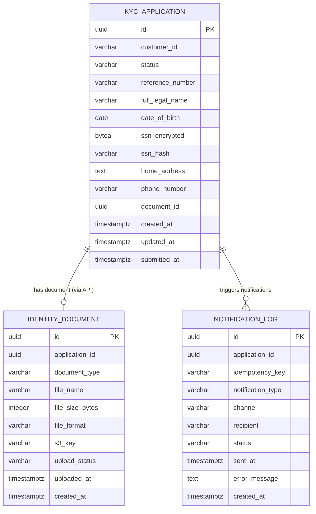
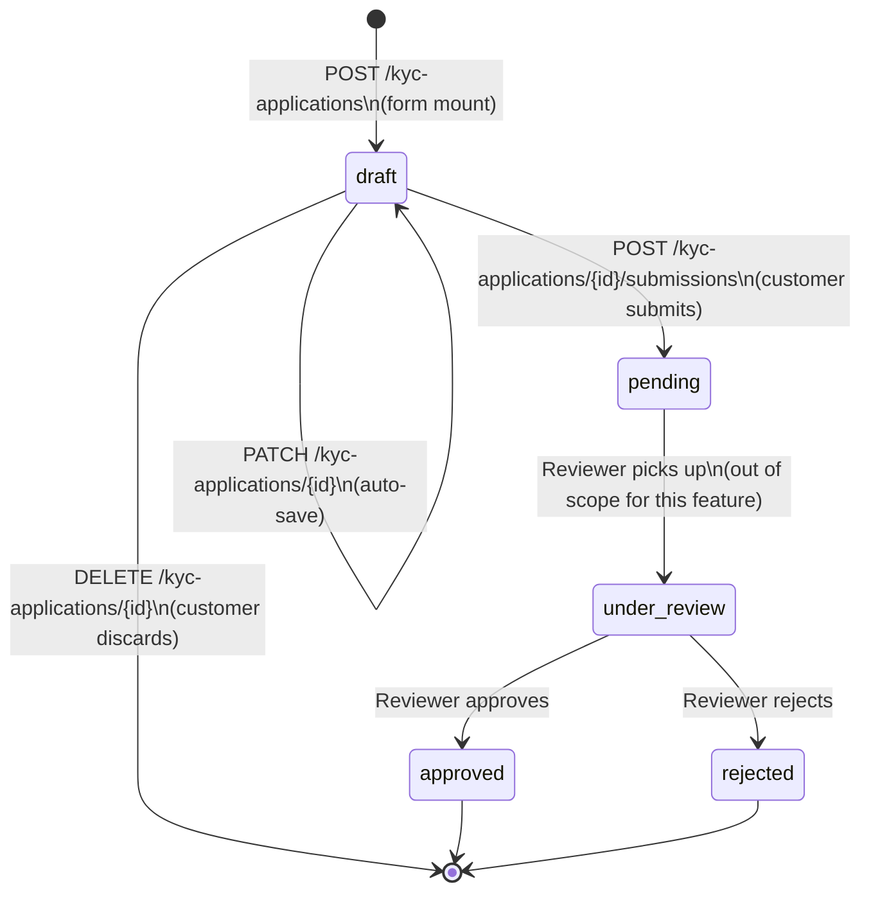

# Data Model: KYC Retail Application Form

**Feature**: 001-kyc-retail-form
**Phase**: 1 — Design
**Date**: 2026-06-17

---

## Entity Relationship Diagram



**Note**: Relationships are logical (enforced via API, not foreign keys). Schemas are
owned by separate microservices; no cross-schema DB constraints exist.

---

## KYC Application State Machine



**Transition rules**:
- Only `draft` → `pending` is triggered by the customer-facing API
- Only one application per customer may exist in `draft`, `pending`, or `under_review` state
  (enforced by partial unique index)
- `reference_number` is generated only on transition to `pending`
- `submitted_at` is set only on transition to `pending`

---

## Entity Definitions

### 1. KYC Application (`kyc.applications`)

| Field | Type | Required | Constraints | Notes |
|-------|------|----------|-------------|-------|
| `id` | UUID | YES | PK, generated | Stable application identifier |
| `customer_id` | VARCHAR(255) | YES | NOT NULL | Cognito `sub` claim |
| `status` | VARCHAR(20) | YES | CHECK enum | draft / pending / under_review / approved / rejected |
| `reference_number` | VARCHAR(50) | NO | UNIQUE, nullable | Set on submission; format: `KYC-YYYYMMDD-NNNNNN` |
| `full_legal_name` | VARCHAR(255) | NO* | NULL until first PATCH | Required for submission validation |
| `date_of_birth` | DATE | NO* | NULL until first PATCH | Customer age ≥ 18 at submission time |
| `ssn_encrypted` | BYTEA | NO* | NULL until first PATCH | AES-256-GCM via AWS KMS; never returned in API response |
| `ssn_hash` | VARCHAR(64) | NO* | NULL until first PATCH | SHA-256(salt + raw_ssn); checked at submission against all active (pending/under_review) applications across all customer accounts (FR-017 cross-customer SSN deduplication) |
| `home_address` | TEXT | NO* | NULL until first PATCH | Free-form address; required for submission |
| `phone_number` | VARCHAR(20) | NO | NULL | Optional; NANP format if present |
| `document_id` | UUID | NO | NULL until upload | Set by kyc-service after document-service confirms upload |
| `created_at` | TIMESTAMPTZ | YES | DEFAULT NOW() | |
| `updated_at` | TIMESTAMPTZ | YES | DEFAULT NOW() | Updated on every PATCH |
| `submitted_at` | TIMESTAMPTZ | NO | NULL until submit | Set when status → pending |

*Fields marked NO* are nullable in the DB but validated as required at submission time.

**Validation rules**:
- At `POST /submissions`: `full_legal_name`, `date_of_birth`, `ssn_encrypted`, `home_address`,
  `document_id` must all be non-null
- `date_of_birth` must result in age ≥ 18 at submission date
- `phone_number`, if non-null, must match NANP regex: `^\d{3}-\d{3}-\d{4}$`
- `ssn_hash` must not match any existing active (pending/under_review) application under
  a different `customer_id` — cross-customer SSN collision rejects submission (FR-017)
- `status` transitions must follow the state machine above

---

### 2. Identity Document (`documents.identity_documents`)

| Field | Type | Required | Constraints | Notes |
|-------|------|----------|-------------|-------|
| `id` | UUID | YES | PK, generated | |
| `application_id` | UUID | YES | NOT NULL, indexed | Logical reference to `kyc.applications.id` |
| `document_type` | VARCHAR(30) | YES | CHECK enum | `us_drivers_license` or `us_passport` |
| `file_name` | VARCHAR(255) | YES | NOT NULL | Original filename as uploaded |
| `file_size_bytes` | INTEGER | YES | 1 – 5,242,880 | 5 MB max; CHECK constraint |
| `file_format` | VARCHAR(10) | YES | CHECK enum | `jpeg`, `png`, `pdf` |
| `s3_key` | VARCHAR(512) | YES | UNIQUE | `documents/{app_id}/{doc_id}/{filename}` |
| `upload_status` | VARCHAR(20) | YES | CHECK enum | `pending` / `uploaded` / `failed` |
| `uploaded_at` | TIMESTAMPTZ | NO | NULL until confirmed | Set when S3 HeadObject confirms presence |
| `created_at` | TIMESTAMPTZ | YES | DEFAULT NOW() | |

**Validation rules**:
- `document_type` must be one of the two accepted types (enforced at application layer before insert)
- `file_format` derived from MIME type inspection + file extension (both must agree)
- `file_size_bytes` must be ≤ 5,242,880 (5 × 1024²) — checked before presigned URL generation

---

### 3. Notification Log (`notifications.notification_log`)

| Field | Type | Required | Constraints | Notes |
|-------|------|----------|-------------|-------|
| `id` | UUID | YES | PK, generated | |
| `application_id` | UUID | YES | NOT NULL, indexed | Logical reference to submitted application |
| `idempotency_key` | VARCHAR(100) | YES | UNIQUE | `{application_id}:{notification_type}` prevents duplicate sends |
| `notification_type` | VARCHAR(50) | YES | CHECK enum | `submission_confirmation` |
| `channel` | VARCHAR(10) | YES | CHECK enum | `email` or `sms` |
| `recipient` | VARCHAR(255) | YES | NOT NULL | Email or phone from customer profile (on file with bank) |
| `status` | VARCHAR(10) | YES | CHECK enum | `pending` / `sent` / `failed` |
| `sent_at` | TIMESTAMPTZ | NO | NULL until sent | |
| `error_message` | TEXT | NO | NULL on success | Sanitized error for failed sends |
| `created_at` | TIMESTAMPTZ | YES | DEFAULT NOW() | |

---

## Value Objects

### SSN

```
Format:       XXX-XX-XXXX (display/input only)
Stored as:    BYTEA (AES-256-GCM encrypted via AWS KMS)
Hash:         SHA-256(SECRET_SALT + raw_digits_only)
Never in:     API responses, logs, error messages
Domain rules: Must match regex /^\d{3}-\d{2}-\d{4}$/
              Must not be all same digit (e.g., 111-11-1111)
              Must not be 000-xx-xxxx or xxx-xx-0000
```

### DocumentType

```
Allowed values: us_drivers_license | us_passport
Source:         Customer selection via UI dropdown (not derived from file content)
Stored as:      VARCHAR(30) with CHECK constraint
```

### ApplicationStatus

```
Valid values:   draft | pending | under_review | approved | rejected
Transitions:    See state machine above
Guard rules:    Only the owning microservice mutates status
                customer_id on application must match JWT sub on all mutations
```

### ReferenceNumber

```
Format:   KYC-YYYYMMDD-NNNNNN (e.g., KYC-20260617-000001)
Generated: On transition draft → pending
Uniqueness: UNIQUE constraint on kyc.applications.reference_number
Exposure:   Returned in submission response and confirmation notification
```

---

## PostgreSQL Migration Files

Each service manages its own migrations under `src/infrastructure/persistence/migrations/`.

**kyc-service migrations**:
```
0001_create_schema_and_applications.sql
0002_add_partial_unique_index.sql
```

**document-service migrations**:
```
0001_create_schema_and_identity_documents.sql
```

**notification-service migrations**:
```
0001_create_schema_and_notification_log.sql
```

---

## Indexes Summary

| Table | Index | Type | Purpose |
|-------|-------|------|---------|
| `kyc.applications` | `idx_kyc_applications_customer_id` | B-tree | Customer lookup |
| `kyc.applications` | `uq_kyc_active_per_customer` | Partial unique | Enforce one active app per customer |
| `kyc.applications` | `idx_kyc_applications_status` | B-tree | Status filtering |
| `kyc.applications` | `idx_kyc_applications_ssn_hash` | B-tree | Cross-customer SSN deduplication lookup (FR-017) |
| `kyc.applications` | `idx_kyc_applications_reference` | Partial B-tree | Reference number lookup |
| `documents.identity_documents` | `idx_docs_application_id` | B-tree | Document lookup by application |
| `notifications.notification_log` | `idx_notif_application_id` | B-tree | Notification lookup by application |
| `notifications.notification_log` | `uq_notif_idempotency_key` | Unique | Prevent duplicate notifications |
