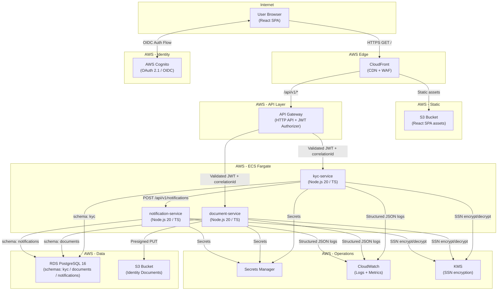
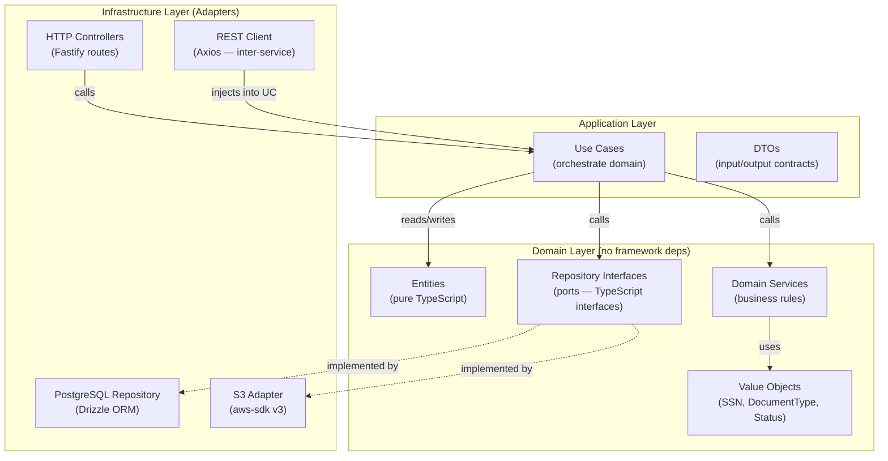
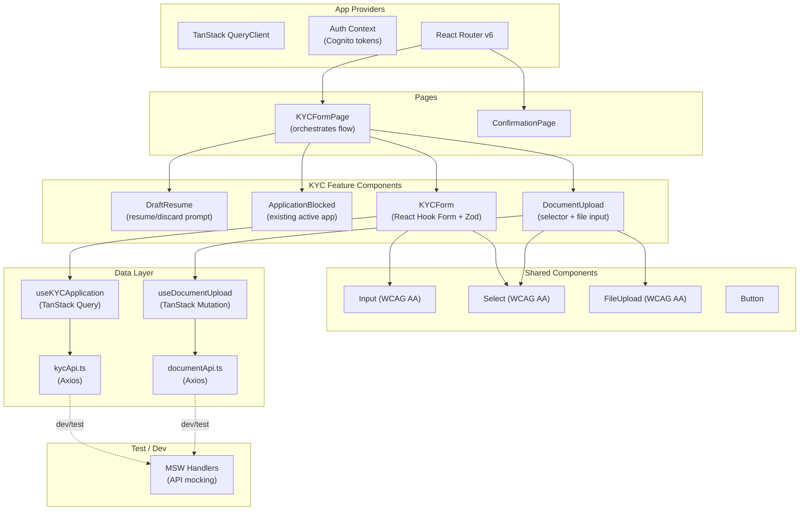
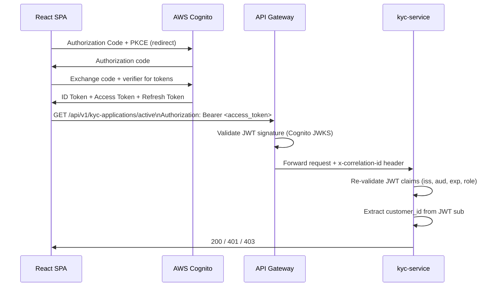
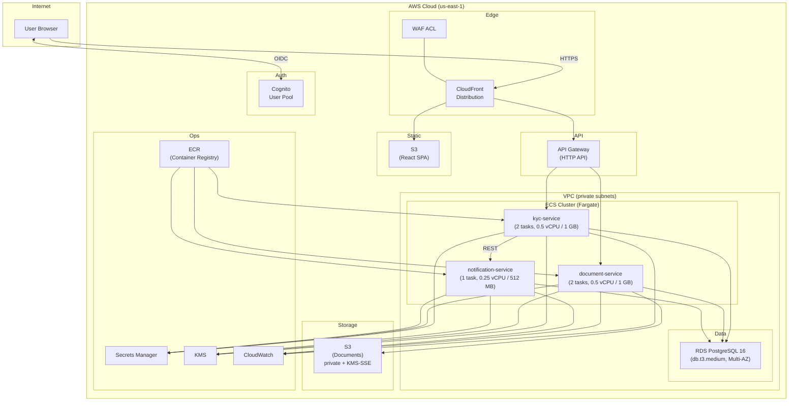

# Implementation Plan: KYC Retail Application Form

**Branch**: `001-kyc-retail-form` | **Date**: 2026-06-17 | **Spec**: [spec.md](./spec.md)

**Input**: Feature specification from `/specs/001-kyc-retail-form/spec.md`

---

## Summary

Build a KYC (Know Your Customer) submission platform for retail bank customers. The customer
completes a 4-field personal information form (Full Legal Name, Date of Birth, SSN, Home
Address) with an optional US Phone Number, selects a document type (US Driver's License or
US Passport) via a pre-populated selector, uploads the corresponding file (JPEG/PNG/PDF,
≤ 5 MB), and submits to receive a unique reference number. The platform auto-saves drafts
server-side and blocks duplicate active-application submissions.

The system is implemented as a React SPA backed by three microservices (kyc-service,
document-service, notification-service) following Hexagonal Architecture, deployed on AWS
(S3/CloudFront, API Gateway, ECS Fargate, RDS PostgreSQL). Authentication is delegated to
AWS Cognito via OAuth 2.1/OIDC.

---

## Technical Context

**Language/Version**:
- Frontend: TypeScript 5.4, React 18.3
- Backend services: TypeScript 5.4, Node.js 20 LTS (all three services)

**Primary Dependencies**:
- Frontend: React 18, TanStack Query 5, React Router 6, Axios, React Hook Form,
  Zod (validation), ESLint, Prettier, Storybook 8
- Backend: Fastify 4 (HTTP server), Drizzle ORM (PostgreSQL), Zod (schema validation),
  Winston (logging), jose (JWT validation), aws-sdk v3
- Infrastructure: AWS CDK v2 (TypeScript)

**Storage**:
- Amazon RDS PostgreSQL 16 (shared instance, three isolated schemas: `kyc`, `documents`,
  `notifications`)
- Amazon S3 (identity document file storage)

**Testing**:
- Frontend: Vitest, React Testing Library, MSW (Mock Service Worker)
- Backend: Vitest, Supertest (integration), Dredd (OpenAPI contract validation)

**Target Platform**: AWS (ECS Fargate, us-east-1), Linux containers

**Project Type**: Full-stack web application (React SPA + microservices REST API)

**Performance Goals**:
- API p95 response time < 500 ms (non-upload endpoints)
- Document upload p95 < 3 s (for files up to 5 MB)
- SPA initial load < 2 s (CloudFront cached)

**Constraints**:
- Maximum document file size: 5 MB
- All PII (SSN) encrypted at rest using AWS KMS
- HTTPS/TLS required everywhere
- WCAG AA accessibility compliance on frontend

**Scale/Scope**:
- Demo scale: supports up to 100 concurrent KYC sessions
- Single region deployment (us-east-1)

---

## Constitution Check

*GATE: Must pass before Phase 0 research. Re-checked after Phase 1 design.*

| Principle | Requirement | Status |
|-----------|-------------|--------|
| I. Architecture-First | React SPA + microservices + Hexagonal Architecture | ✅ All three services use Hexagonal Architecture; domain layer is framework-free |
| I. Architecture-First | OpenAPI-first development | ✅ OpenAPI specs in `contracts/` are authored before implementation |
| I. Architecture-First | AWS S3/CloudFront for SPA | ✅ Planned — see Deployment Architecture |
| I. Architecture-First | ECS Fargate for services | ✅ Planned — see Deployment Architecture |
| I. Architecture-First | RDS for PostgreSQL | ✅ Planned — shared RDS instance |
| II. Security by Design | OAuth 2.1 + OIDC via external IdP | ✅ AWS Cognito; JWT Bearer tokens |
| II. Security by Design | RBAC enforced | ✅ `retail_customer` role checked at service boundary |
| II. Security by Design | JWT validation at service boundaries | ✅ Each service validates JWT independently |
| II. Security by Design | Secrets in AWS Secrets Manager | ✅ DB credentials, KMS key ARN stored in Secrets Manager |
| II. Security by Design | Sensitive data not logged | ✅ SSN, document contents excluded from all log outputs |
| II. Security by Design | Cross-customer SSN deduplication (FR-017) | ✅ `ssn_hash` checked at submission against all active applications across all `customer_id` values; rejection message reveals no conflicting identity |
| III. Data Integrity | Per-service PostgreSQL schema | ✅ `kyc`, `documents`, `notifications` schemas owned by respective services |
| III. Data Integrity | No cross-schema direct access | ✅ Services access other domains only via REST API calls |
| III. Data Integrity | Migrations version-controlled | ✅ Drizzle Kit migrations committed with source code |
| IV. API-First | Resource-oriented endpoints, no verbs | ✅ All endpoints use noun-based resources; `/submissions` sub-resource for submit action |
| IV. API-First | OpenAPI specs maintained with source | ✅ `contracts/` directory contains OpenAPI 3.1 YAML files for all three services (kyc-service, document-service, notification-service) |
| IV. API-First | URI versioning `/api/v1/` | ✅ All routes prefixed `/api/v1/` |
| IV. API-First | Standard error response (code/message/details/correlationId) | ✅ Fastify error handler enforces standard error schema |
| IV. API-First | Pagination on collection endpoints | ✅ `GET /api/v1/kyc-applications` supports `page`/`limit` |
| V. Test-Driven Quality | Unit tests for domain + application layers | ✅ Vitest unit tests scoped to `src/domain` and `src/application` |
| V. Test-Driven Quality | Every endpoint has a test suite | ✅ Integration test file per endpoint in `tests/integration/` |
| V. Test-Driven Quality | Tests validate OpenAPI contracts | ✅ Dredd runs against live OpenAPI spec in CI |

**Constitution Check result**: ✅ All gates pass. No violations to justify.

*Re-checked 2026-06-17 post-clarification: FR-017 (SSN cross-customer deduplication) added;
notification-service OpenAPI contract added to `contracts/`; CDK stacks fully enumerated.*

---

## Project Structure

### Documentation (this feature)

```text
specs/001-kyc-retail-form/
├── plan.md              # This file
├── research.md          # Phase 0: technology decisions
├── data-model.md        # Phase 1: entities, schema, ERD
├── quickstart.md        # Phase 1: validation guide
├── contracts/
│   ├── kyc-service.yaml           # OpenAPI 3.1 — KYC Application Service
│   ├── document-service.yaml      # OpenAPI 3.1 — Document Service
│   └── notification-service.yaml  # OpenAPI 3.1 — Notification Service (internal)
└── tasks.md             # Phase 2 output (/speckit-tasks command)
```

### Source Code (repository root)

```text
(repo root)/
│
├── frontend/                            # React SPA (TypeScript 5.4, React 18)
│   ├── src/
│   │   ├── app/
│   │   │   ├── App.tsx                  # Root component, router setup
│   │   │   ├── providers.tsx            # QueryClientProvider, AuthProvider
│   │   │   └── router.tsx               # React Router route definitions
│   │   ├── features/
│   │   │   └── kyc/
│   │   │       ├── components/
│   │   │       │   ├── KYCForm.tsx      # 4 required + 1 optional field form
│   │   │       │   ├── DocumentUpload.tsx # Type selector + file upload
│   │   │       │   ├── DraftResume.tsx  # Resume/discard draft prompt
│   │   │       │   └── ApplicationBlocked.tsx # Duplicate application block
│   │   │       ├── hooks/
│   │   │       │   ├── useKYCApplication.ts  # TanStack Query CRUD
│   │   │       │   └── useDocumentUpload.ts  # TanStack Mutation + progress
│   │   │       ├── pages/
│   │   │       │   ├── KYCFormPage.tsx       # Orchestrates form + upload flow
│   │   │       │   └── ConfirmationPage.tsx  # Post-submit confirmation
│   │   │       └── api/
│   │   │           ├── kycApi.ts        # Axios calls to kyc-service
│   │   │           └── documentApi.ts   # Axios calls to document-service
│   │   └── shared/
│   │       ├── components/              # Button, Input, Select, FileUpload, etc.
│   │       └── lib/
│   │           ├── queryClient.ts       # TanStack Query client config
│   │           └── apiClient.ts         # Axios instance (base URL, auth headers)
│   ├── .storybook/                      # Storybook 8 config
│   ├── tests/
│   │   ├── unit/                        # Component unit tests (Vitest + RTL)
│   │   └── mocks/                       # MSW handlers
│   └── public/
│
├── services/
│   ├── kyc-service/                     # KYC Application lifecycle management
│   │   ├── src/
│   │   │   ├── domain/
│   │   │   │   ├── entities/
│   │   │   │   │   └── KYCApplication.ts
│   │   │   │   ├── value-objects/
│   │   │   │   │   ├── SSN.ts           # SSN value object (validates + hashes)
│   │   │   │   │   ├── ReferenceNumber.ts
│   │   │   │   │   └── ApplicationStatus.ts
│   │   │   │   ├── repositories/
│   │   │   │   │   └── IKYCApplicationRepository.ts  # Port interface
│   │   │   │   └── services/
│   │   │   │       └── KYCDomainService.ts
│   │   │   ├── application/
│   │   │   │   ├── use-cases/
│   │   │   │   │   ├── CreateDraftApplicationUseCase.ts
│   │   │   │   │   ├── UpdateDraftApplicationUseCase.ts
│   │   │   │   │   ├── SubmitApplicationUseCase.ts
│   │   │   │   │   └── GetActiveApplicationUseCase.ts
│   │   │   │   └── dtos/
│   │   │   │       ├── CreateApplicationDto.ts
│   │   │   │       └── UpdateApplicationDto.ts
│   │   │   └── infrastructure/
│   │   │       ├── http/
│   │   │       │   ├── server.ts        # Fastify server setup
│   │   │       │   ├── routes/          # Route registration
│   │   │       │   ├── controllers/     # Request/response handling
│   │   │       │   └── middleware/
│   │   │       │       ├── auth.ts      # JWT validation (jose)
│   │   │       │       ├── correlation.ts # Correlation ID injection
│   │   │       │       └── errorHandler.ts
│   │   │       ├── persistence/
│   │   │       │   ├── schema.ts        # Drizzle schema (kyc schema)
│   │   │       │   ├── KYCApplicationRepository.ts
│   │   │       │   └── migrations/      # Drizzle Kit migration files
│   │   │       └── http-client/
│   │   │           └── NotificationServiceClient.ts  # REST client
│   │   └── tests/
│   │       ├── unit/                    # Domain + use case unit tests
│   │       └── integration/             # Endpoint integration tests (Supertest)
│   │
│   ├── document-service/                # Identity document upload + S3 management
│   │   ├── src/
│   │   │   ├── domain/
│   │   │   │   ├── entities/
│   │   │   │   │   └── IdentityDocument.ts
│   │   │   │   ├── value-objects/
│   │   │   │   │   ├── DocumentType.ts  # us_drivers_license | us_passport
│   │   │   │   │   └── FileMetadata.ts  # format, size, s3Key
│   │   │   │   └── repositories/
│   │   │   │       └── IIdentityDocumentRepository.ts
│   │   │   ├── application/
│   │   │   │   └── use-cases/
│   │   │   │       ├── InitiateUploadUseCase.ts  # Presigned URL + create record
│   │   │   │       └── ConfirmUploadUseCase.ts   # Verify S3 + mark uploaded
│   │   │   └── infrastructure/
│   │   │       ├── http/
│   │   │       │   ├── server.ts
│   │   │       │   ├── routes/
│   │   │       │   └── controllers/
│   │   │       ├── persistence/
│   │   │       │   ├── schema.ts        # Drizzle schema (documents schema)
│   │   │       │   ├── IdentityDocumentRepository.ts
│   │   │       │   └── migrations/
│   │   │       └── storage/
│   │   │           └── S3DocumentStorage.ts  # AWS S3 adapter
│   │   └── tests/
│   │       ├── unit/
│   │       └── integration/
│   │
│   └── notification-service/            # Confirmation notification dispatch
│       ├── src/
│       │   ├── domain/
│       │   │   ├── entities/
│       │   │   │   └── NotificationLog.ts
│       │   │   └── repositories/
│       │   │       └── INotificationLogRepository.ts
│       │   ├── application/
│       │   │   └── use-cases/
│       │   │       └── SendConfirmationUseCase.ts
│       │   └── infrastructure/
│       │       ├── http/
│       │       │   ├── server.ts
│       │       │   └── routes/
│       │       ├── persistence/
│       │       │   ├── schema.ts        # Drizzle schema (notifications schema)
│       │       │   ├── NotificationLogRepository.ts
│       │       │   └── migrations/
│       │       └── channels/
│       │           └── EmailNotificationChannel.ts  # AWS SES adapter
│       └── tests/
│           ├── unit/
│           └── integration/
│
├── infrastructure/                      # AWS CDK v2 (TypeScript)
│   ├── bin/
│   │   └── kyc-demo.ts                  # CDK App entry point
│   └── lib/
│       ├── networking-stack.ts          # VPC, subnets, security groups  [T059]
│       ├── database-stack.ts            # RDS PostgreSQL 16 (Multi-AZ)   [T060]
│       ├── compute-stack.ts             # ECS cluster, Fargate services   [T061]
│       ├── storage-stack.ts             # S3 buckets (SPA + documents)   [T040]
│       ├── api-stack.ts                 # API Gateway, CloudFront         [T062]
│       └── auth-stack.ts               # Cognito User Pool + App Client  [T063]
│
├── .github/
│   └── workflows/
│       ├── ci.yml                       # Lint, test, OpenAPI validation
│       ├── build-push.yml               # Build Docker images, push to ECR
│       └── deploy.yml                   # CDK deploy to ECS
│
└── specs/                               # SpecKit documentation
    └── 001-kyc-retail-form/
```

**Structure Decision**: Web application — Option 2 pattern with frontend + three backend
microservices under `services/` + AWS CDK infrastructure under `infrastructure/`. Each
service is independently deployable with its own Docker image, migrations, and test suite.

---

## 1. High-Level System Architecture



---

## 2. Microservices Architecture

Three microservices, each independently deployable, each owning its own PostgreSQL schema:

| Service | Responsibility | Schema | Port |
|---------|---------------|--------|------|
| **kyc-service** | KYC Application lifecycle (draft → pending → approved/rejected), duplicate detection, draft auto-save | `kyc` | 3001 |
| **document-service** | Document type selector enforcement, file upload to S3, format/size validation, metadata persistence | `documents` | 3002 |
| **notification-service** | Confirmation notification dispatch via email (AWS SES), notification log | `notifications` | 3003 |

**Inter-service communication**: Synchronous REST (per constitution). kyc-service calls
notification-service REST API after a successful submission. document-service is called
directly by the frontend (API Gateway routes).

**No shared libraries between services** beyond type definitions. Each service is
independently versionable and deployable.

---

## 3. Backend Hexagonal Architecture (per service)



**Dependency Rule**: All arrows point inward. Domain layer has zero imports from
infrastructure or application. Application layer imports domain only. Infrastructure imports
application + domain interfaces, never the reverse.

**Key domain objects per service**:

*kyc-service*:
- `KYCApplication` entity — lifecycle, validation, status transitions
- `SSN` value object — validates format, encrypts via KMS for persistence
- `ApplicationStatus` value object — enforces valid state transitions
- `IKYCApplicationRepository` port — `findByCustomerId`, `save`, `findActiveByCustomerId`

*document-service*:
- `IdentityDocument` entity — type enforcement, file metadata
- `DocumentType` value object — `us_drivers_license | us_passport` only
- `FileMetadata` value object — format, size (≤ 5 MB), S3 key
- `IIdentityDocumentRepository` port + `IDocumentStorage` port (S3)

*notification-service*:
- `NotificationLog` entity — channel, recipient, status, idempotency key
- `SendConfirmationUseCase` — orchestrates channel selection + log persistence

---

## 4. Frontend React Architecture



**State management strategy**:
- Server state: TanStack Query (caching, auto-refetch, optimistic updates)
- Form state: React Hook Form + Zod schemas (co-located in feature)
- UI state: React `useState` / `useReducer` (local, no global store)
- Auth state: Context provider wrapping Cognito `Auth` singleton

**Feature-based folder structure** — each feature owns its components, hooks, pages, and
API functions. Shared components are in `/shared/components/` and covered by Storybook.

---

## 5. Database Architecture

**Strategy**: Shared RDS PostgreSQL 16 instance (Multi-AZ for resilience), three isolated
schemas. Cross-schema access is prohibited — enforced by per-service database users with
schema-scoped GRANT/REVOKE.

**Database users**:
- `kyc_app` — USAGE + all privileges on `kyc` schema only
- `document_app` — USAGE + all privileges on `documents` schema only
- `notification_app` — USAGE + all privileges on `notifications` schema only

**Cross-service data access**: kyc-service passes `application_id` to document-service
and notification-service via REST API calls. No direct FK constraints across schemas.

---

## 6. PostgreSQL Schema Design

```sql
-- ============================================================
-- Schema: kyc (owned by kyc-service)
-- ============================================================
CREATE SCHEMA kyc;

CREATE TABLE kyc.applications (
    id                UUID        PRIMARY KEY DEFAULT gen_random_uuid(),
    customer_id       VARCHAR(255) NOT NULL,
    status            VARCHAR(20)  NOT NULL DEFAULT 'draft',
    reference_number  VARCHAR(50)  UNIQUE,
    full_legal_name   VARCHAR(255),
    date_of_birth     DATE,
    ssn_encrypted     BYTEA,           -- AES-256 via AWS KMS
    ssn_hash          VARCHAR(64),     -- SHA-256(salt+ssn) for duplicate detection
    home_address      TEXT,
    phone_number      VARCHAR(20),     -- optional, NANP format
    document_id       UUID,            -- populated after document upload (via API)
    created_at        TIMESTAMPTZ NOT NULL DEFAULT NOW(),
    updated_at        TIMESTAMPTZ NOT NULL DEFAULT NOW(),
    submitted_at      TIMESTAMPTZ,
    CONSTRAINT kyc_applications_status_check
        CHECK (status IN ('draft','pending','under_review','approved','rejected'))
);

CREATE UNIQUE INDEX uq_kyc_active_per_customer
    ON kyc.applications (customer_id)
    WHERE status IN ('draft','pending','under_review');

CREATE INDEX idx_kyc_applications_customer_id ON kyc.applications (customer_id);
CREATE INDEX idx_kyc_applications_status      ON kyc.applications (status);
CREATE INDEX idx_kyc_applications_reference   ON kyc.applications (reference_number)
    WHERE reference_number IS NOT NULL;

-- ============================================================
-- Schema: documents (owned by document-service)
-- ============================================================
CREATE SCHEMA documents;

CREATE TABLE documents.identity_documents (
    id              UUID        PRIMARY KEY DEFAULT gen_random_uuid(),
    application_id  UUID        NOT NULL,       -- logical FK via API, no DB FK cross-schema
    document_type   VARCHAR(30) NOT NULL,
    file_name       VARCHAR(255) NOT NULL,
    file_size_bytes INTEGER     NOT NULL,
    file_format     VARCHAR(10) NOT NULL,
    s3_key          VARCHAR(512) NOT NULL UNIQUE,
    upload_status   VARCHAR(20) NOT NULL DEFAULT 'pending',
    uploaded_at     TIMESTAMPTZ,
    created_at      TIMESTAMPTZ NOT NULL DEFAULT NOW(),
    CONSTRAINT docs_type_check
        CHECK (document_type IN ('us_drivers_license','us_passport')),
    CONSTRAINT docs_format_check
        CHECK (file_format IN ('jpeg','png','pdf')),
    CONSTRAINT docs_size_check
        CHECK (file_size_bytes > 0 AND file_size_bytes <= 5242880), -- 5 MB
    CONSTRAINT docs_status_check
        CHECK (upload_status IN ('pending','uploaded','failed'))
);

CREATE INDEX idx_docs_application_id ON documents.identity_documents (application_id);

-- ============================================================
-- Schema: notifications (owned by notification-service)
-- ============================================================
CREATE SCHEMA notifications;

CREATE TABLE notifications.notification_log (
    id                UUID        PRIMARY KEY DEFAULT gen_random_uuid(),
    application_id    UUID        NOT NULL,
    idempotency_key   VARCHAR(100) UNIQUE NOT NULL, -- prevents duplicate sends
    notification_type VARCHAR(50) NOT NULL,
    channel           VARCHAR(10) NOT NULL,
    recipient         VARCHAR(255) NOT NULL,
    status            VARCHAR(10) NOT NULL DEFAULT 'pending',
    sent_at           TIMESTAMPTZ,
    error_message     TEXT,
    created_at        TIMESTAMPTZ NOT NULL DEFAULT NOW(),
    CONSTRAINT notif_type_check
        CHECK (notification_type IN ('submission_confirmation')),
    CONSTRAINT notif_channel_check
        CHECK (channel IN ('email','sms')),
    CONSTRAINT notif_status_check
        CHECK (status IN ('pending','sent','failed'))
);

CREATE INDEX idx_notif_application_id ON notifications.notification_log (application_id);
```

---

## 7. Database Migration Strategy

**Tooling**: Drizzle Kit (per service; each service manages its own schema migrations).

**Conventions**:
- Migration files are committed alongside source code in `src/infrastructure/persistence/migrations/`
- Each file is timestamped: `0001_create_applications.sql`, `0002_add_document_id.sql`, etc.
- Migrations run on service startup (via `drizzle-kit migrate` before the HTTP server starts)
- All production migrations MUST be backward-compatible (additive changes only; destructive changes require two-phase migration: add → dual-read → remove)

**Migration workflow**:
1. Developer modifies Drizzle schema in `schema.ts`
2. `npx drizzle-kit generate` produces the SQL migration file
3. Migration committed with the feature branch
4. CI validates migration runs cleanly on a test DB
5. Production migration runs automatically on ECS task startup (before health check passes)

---

## 8. REST API Design

See `contracts/kyc-service.yaml` and `contracts/document-service.yaml` for full OpenAPI
3.1 specifications. Summary below.

### KYC Service — `/api/v1/kyc-applications`

| Method | Path | Description | Auth |
|--------|------|-------------|------|
| `POST` | `/api/v1/kyc-applications` | Create a new draft application (or return existing draft) | Bearer JWT |
| `GET` | `/api/v1/kyc-applications/active` | Get caller's active application (any non-rejected status) | Bearer JWT |
| `PATCH` | `/api/v1/kyc-applications/{id}` | Update draft fields (auto-save progress) | Bearer JWT |
| `POST` | `/api/v1/kyc-applications/{id}/submissions` | Submit application for review | Bearer JWT |
| `GET` | `/api/v1/kyc-applications/{id}` | Get application detail + status | Bearer JWT |
| `GET` | `/api/v1/kyc-applications` | List applications for customer (paginated) | Bearer JWT |

### Document Service — `/api/v1/documents`

| Method | Path | Description | Auth |
|--------|------|-------------|------|
| `GET` | `/api/v1/document-types` | List accepted document types (static) | Bearer JWT |
| `POST` | `/api/v1/documents` | Upload identity document (multipart/form-data) | Bearer JWT |
| `GET` | `/api/v1/documents/{id}` | Get document metadata | Bearer JWT |

**Standard error response** (all services):
```json
{
  "code": "VALIDATION_ERROR",
  "message": "Date of birth must indicate age ≥ 18",
  "details": [{ "field": "dateOfBirth", "issue": "AGE_BELOW_MINIMUM" }],
  "correlationId": "uuid-v4"
}
```

---

## 9. OpenAPI Contract Plan

See:
- `specs/001-kyc-retail-form/contracts/kyc-service.yaml`
- `specs/001-kyc-retail-form/contracts/document-service.yaml`

**Contract authoring rules** (per constitution):
- Specs are authored before implementation (OpenAPI-first)
- Every endpoint has request schema, response schema, and mock examples
- Breaking changes require a new version prefix (`/api/v2/`)
- Dredd validates contracts against the live service in CI

---

## 10. Authentication and Authorization Architecture

**Provider**: AWS Cognito User Pool (OAuth 2.1 / OIDC)

**Flow**: Authorization Code with PKCE (from React SPA via Amplify JS or oidc-client-ts)

**Token types**:
- **ID Token**: contains user claims (`email`, `custom:role`)
- **Access Token**: JWT, HS256/RS256, presented as `Authorization: Bearer <token>`

**Authorization**:
- RBAC claim in JWT: `custom:role` = `retail_customer`
- Each service validates `custom:role` in middleware; 403 if role does not match
- kyc-service enforces that `customer_id` in the application record matches the JWT `sub`
  claim (prevents horizontal privilege escalation)

**Secrets**: Cognito App Client ID and User Pool ID stored in AWS Secrets Manager;
injected as environment variables at ECS task startup.

---

## 11. JWT / OIDC Security Flow



---

## 12. AWS Deployment Architecture



---

## 13. S3 Document Storage Architecture

**Bucket**: `kyc-demo-identity-documents-{account-id}` (private, versioning enabled)

**Encryption**: SSE-KMS (customer-managed KMS key)

**Object key structure**: `documents/{application_id}/{document_id}/{filename}`

**Upload flow**:
1. document-service generates a presigned PUT URL (15-minute TTL) for the specific S3 key
2. document-service returns the presigned URL to the frontend
3. Frontend uploads file directly to S3 (bypassing API Gateway — avoids 10 MB payload limit)
4. Frontend notifies document-service of upload completion
5. document-service verifies the object exists in S3, updates `upload_status` to `uploaded`

**Access control**:
- Frontend: access via presigned URLs only (no public access)
- Services: IAM role-based access (ECS task role with `s3:GetObject`, `s3:PutObject` scoped to bucket)
- No public S3 bucket access; CloudFront does NOT serve document files

---

## 14. CI/CD Pipeline Design

```text
GitHub Flow:
  feature/* → develop → main

Pipeline triggered on:
  - Pull Request to develop → CI (lint + test + build)
  - Merge to develop → CI + Deploy to staging
  - Tag release/v* → Deploy to production
```

**`.github/workflows/ci.yml`**:
```yaml
Steps:
  1. Lint (ESLint + Prettier check) — frontend + all services
  2. Type check (tsc --noEmit) — frontend + all services
  3. Unit tests (Vitest) — frontend + all services (parallel jobs)
  4. Integration tests (Supertest against test DB) — each service
  5. OpenAPI validation (Dredd) — each service against contracts/
  6. Docker build (smoke test — image builds without error)
```

**`.github/workflows/build-push.yml`**:
```yaml
Steps:
  1. Build Docker images (frontend via nginx, each service)
  2. Push to Amazon ECR
  3. Tag with SHA + semantic version
```

**`.github/workflows/deploy.yml`**:
```yaml
Steps:
  1. cdk diff (review changes)
  2. Run DB migrations (per service, in order)
  3. cdk deploy (ECS rolling update — 100% min healthy, 200% max)
  4. Smoke test (health check endpoints return 200)
  5. Rollback on failure (ECS rollback to previous task definition)
```

---

## 15. Testing Strategy

| Layer | Tool | Scope |
|-------|------|-------|
| Domain unit tests | Vitest | Entities, value objects, domain services — no I/O |
| Use case unit tests | Vitest + mock repos | Application use cases with mocked repository implementations |
| Integration tests | Vitest + Supertest | Full HTTP endpoint tests; real PostgreSQL (Docker), S3 mocked via localstack |
| Contract tests | Dredd | Validates live service responses against OpenAPI YAML |
| Component tests | Vitest + RTL | React components — behavior-focused, no implementation details |
| MSW mocking | MSW 2 | Intercept API calls in frontend tests; handlers mirror OpenAPI contracts |
| E2E (optional) | Playwright | Full browser flows against staging (not in CI critical path) |

**TDD cycle for backend use cases**:
1. Write use case unit test → red
2. Implement use case → green
3. Refactor domain model if needed → green

**OpenAPI-contract alignment**: MSW handler request/response shapes are generated from the
OpenAPI YAML files — no manual duplication of schema.

---

## 16. Observability and Logging Strategy

**Structured logging** (Winston — all services):
```json
{
  "level": "info",
  "service": "kyc-service",
  "correlationId": "uuid-v4",
  "customerId": "cognito-sub-uuid",
  "applicationId": "uuid",
  "event": "application.submitted",
  "durationMs": 42,
  "timestamp": "2026-06-17T12:00:00.000Z"
}
```

**Correlation ID**: Generated at API Gateway (UUID v4), forwarded in `x-correlation-id`
header to all services, included in every log line and all error responses.

**What is NEVER logged**: SSN (raw or encrypted), full document file content, full JWT,
password fields, any PII beyond `customerId` reference.

**CloudWatch configuration**:
- Log groups: `/kyc-demo/{service-name}/{env}` (30-day retention for dev, 90-day for prod)
- Metric filters: 4XX error rate, 5XX error rate, p95 latency, document upload failures
- Alarms: 5XX rate > 1% over 5 min triggers SNS alert

---

## 17. Error Handling Strategy

**HTTP error taxonomy** (all services follow this standard):

| HTTP Code | `code` field | When |
|-----------|-------------|------|
| 400 | `VALIDATION_ERROR` | Request body schema validation failed |
| 401 | `UNAUTHORIZED` | Missing or invalid JWT |
| 403 | `FORBIDDEN` | Valid JWT but insufficient role or wrong `customer_id` |
| 404 | `NOT_FOUND` | Resource does not exist |
| 409 | `CONFLICT` | Duplicate active application exists |
| 422 | `UNPROCESSABLE` | Domain rule violation (e.g., age < 18, invalid SSN) |
| 500 | `INTERNAL_ERROR` | Unexpected server error (do not leak stack traces) |

**Fastify global error handler** normalizes all errors to the standard shape. Domain
exceptions (e.g., `AgeValidationError`) map to 422; infrastructure exceptions (DB
timeout) map to 500 with sanitized message.

**Frontend error handling**:
- TanStack Query `onError` callbacks surface user-friendly messages from `error.message`
- 409 CONFLICT → navigate to `ApplicationBlocked` component, show existing reference number
- 5XX → generic retry prompt with correlation ID displayed for support reference

---

## 18. Scalability Considerations

**Stateless services**: All three Fargate tasks are stateless — horizontal scaling is safe.
Draft session data is persisted in PostgreSQL, not in-memory.

**ECS auto-scaling**: CPU utilization target 60% → scale out; scale in after 5-minute
cooldown. Min 2 tasks / Max 10 tasks per service.

**RDS read replicas**: Add a read replica when read throughput exceeds primary capacity.
Status-check queries (`GET /active`, `GET /{id}`) are candidates for read-replica routing.

**S3 document uploads**: Direct-to-S3 presigned URL flow bypasses API Gateway and ECS for
the heavy upload payload — document-service handles only metadata, not the binary stream.

**CloudFront caching**: React SPA assets are cached at edge (long TTL + content hash
filenames for cache busting). API calls bypass cache (API Gateway).

**Connection pooling**: Each ECS task uses a PgBouncer-compatible pool or Drizzle's built-in
pool (max 10 connections per task; RDS `max_connections` sized accordingly).

---

## 19. Risk and Mitigation Plan

| Risk | Likelihood | Impact | Mitigation |
|------|-----------|--------|------------|
| SSN data breach | Low | Critical | AES-256 KMS encryption at rest; never logged; HTTPS in transit; KMS key rotation |
| Document file upload abuse (oversized/malicious files) | Medium | High | 5 MB size check before S3 write; MIME type validation; WAF rules on CloudFront |
| Duplicate submission race condition (two tabs) | Low | Medium | Partial unique index on `kyc.applications` (customer_id, status IN draft/pending/under_review) enforced at DB level |
| Draft data accumulates PII for abandoned sessions | Medium | Medium | Background job (out of scope) to purge drafts > 30 days; documented in Assumptions |
| JWT token leakage in logs | Low | High | Structured log schema excludes Authorization header; log sanitization middleware |
| RDS single-point-of-failure | Low | High | Multi-AZ RDS; automated failover < 60 seconds |
| ECS task crash during submission | Low | Medium | Idempotent `POST /{id}/submissions` (reference number generated only once); duplicate requests return 409 with existing reference |
| Cognito service outage | Very Low | High | Retry logic with exponential backoff; surface clear "authentication unavailable" message |
| OpenAPI contract drift | Medium | Medium | Dredd contract tests in CI fail the build if service responses diverge from spec |

---

## Complexity Tracking

No constitution violations. No complexity exceptions required.
