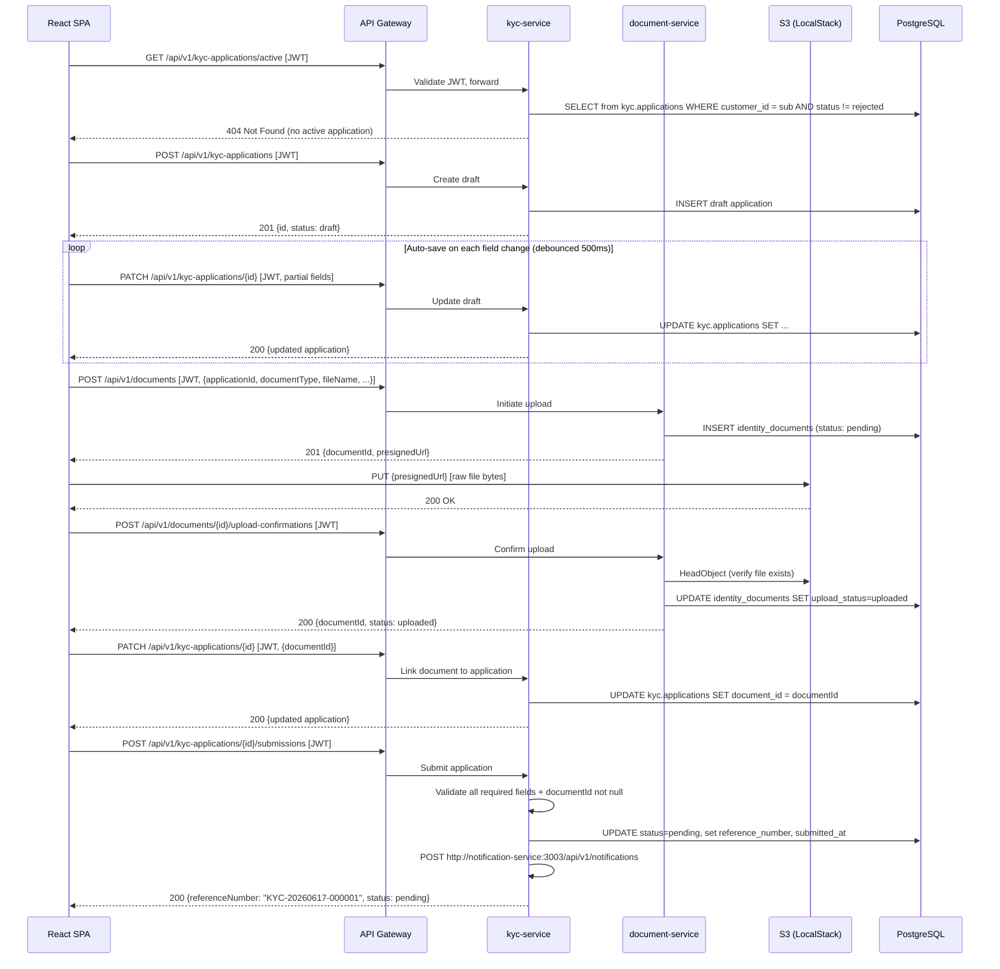
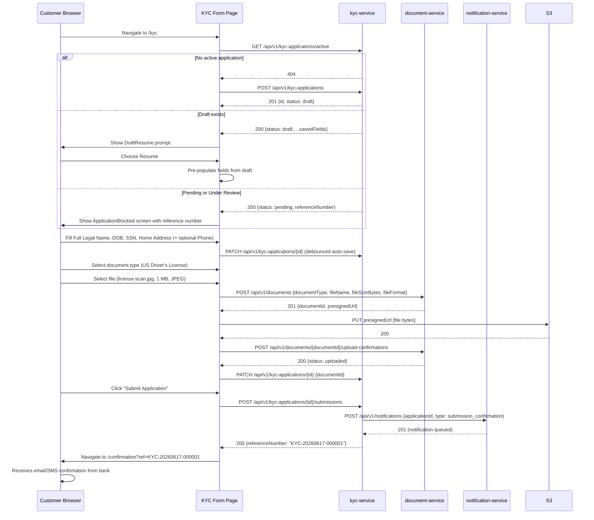

# Quickstart Validation Guide: KYC Retail Application Form

**Feature**: 001-kyc-retail-form
**Phase**: 1 — Design
**Date**: 2026-06-17 (updated 2026-06-17: added Scenarios 11–12; updated Scenario 1 timeline)

This guide describes how to validate end-to-end KYC form functionality once services are
running. It is a run-and-verify guide — not an implementation guide. Implementation details
are in `tasks.md`.

---

## Prerequisites

- Docker and Docker Compose installed
- Node.js 20 LTS installed
- AWS CLI configured (for S3/KMS access in staging; local uses LocalStack)
- All three services built and running (see Setup below)
- An authenticated test user in Cognito (or a test JWT for local development)

---

## Local Setup

```bash
# 1. Start local infrastructure (PostgreSQL + LocalStack)
docker compose up -d postgres localstack

# 2. Run migrations for all services
cd services/kyc-service && npx drizzle-kit migrate && cd ../..
cd services/document-service && npx drizzle-kit migrate && cd ../..
cd services/notification-service && npx drizzle-kit migrate && cd ../..

# 3. Start all services
cd services/kyc-service && npm run dev &        # http://localhost:3001
cd services/document-service && npm run dev &   # http://localhost:3002
cd services/notification-service && npm run dev & # http://localhost:3003

# 4. Start the frontend
cd frontend && npm run dev                       # http://localhost:5173
```

**Test JWT** (local dev only — bypasses Cognito signature check):
```bash
# Set TEST_JWT in each service's .env.local
TEST_JWT=eyJ...  # pre-generated JWT with sub=test-customer-001, role=retail_customer
```

---

## API Request Flow



---

## KYC Approval Sequence



---

## Validation Scenarios

### Scenario 1: Happy Path — Successful KYC Submission

**Setup**: Test customer with no existing applications.

**Steps**:
1. Navigate to `http://localhost:5173/kyc`
2. Verify the form renders with 4 required fields (Full Legal Name, Date of Birth, SSN,
   Home Address) and 1 optional field (US Phone Number)
3. Fill all required fields with valid data:
   - Full Legal Name: `Jane Marie Smith`
   - Date of Birth: `1990-04-15`
   - SSN: `123-45-6789`
   - Home Address: `123 Main Street, Springfield, IL 62701`
4. Observe URL changes or network tab — PATCH call fires (auto-save)
5. Select document type: `US Driver's License`
6. Upload a JPEG file ≤ 5 MB
7. Observe upload progress and success confirmation
8. Click "Submit Application"
9. Verify navigation to `/confirmation` page
10. Verify reference number displays in format `KYC-YYYYMMDD-NNNNNN`

**Expected outcome**: Confirmation page shows reference number and "3 business days"
review timeline. Database record in `kyc.applications` has `status = pending`,
`submitted_at` set, `reference_number` set.

---

### Scenario 2: Required Field Validation

**Steps**:
1. Navigate to `/kyc`
2. Leave Full Legal Name empty, fill remaining fields
3. Click "Next" (or attempt to advance to document upload)

**Expected outcome**: Field-level error message appears next to Full Legal Name.
Form does not advance. No PATCH is triggered for submission.

---

### Scenario 3: Age Validation (Under 18)

**Steps**:
1. Enter Date of Birth: any date within 18 years of today (e.g., `2012-01-01`)
2. Tab away from the field

**Expected outcome**: Inline error "Applicant must be at least 18 years old."
Advancement blocked.

---

### Scenario 4: Invalid SSN Format

**Steps**:
1. Enter SSN: `12345` (incomplete)
2. Tab away from the field

**Expected outcome**: Inline error "SSN must be in format XXX-XX-XXXX."

---

### Scenario 5: File Too Large

**Steps**:
1. Complete personal information fields
2. Select document type: `US Passport`
3. Attempt to upload a file > 5 MB

**Expected outcome**: Error message "File size exceeds the 5 MB limit." File not uploaded.
No presigned URL generated (client-side check fires before API call).

---

### Scenario 6: Unsupported File Format

**Steps**:
1. Complete personal information fields
2. Select document type: `US Driver's License`
3. Attempt to upload a `.docx` file

**Expected outcome**: Error "Unsupported file format. Accepted formats: JPEG, PNG, PDF."
File upload control rejects the file.

---

### Scenario 7: Duplicate Application Block

**Setup**: Seed a `pending` application for test customer with reference `KYC-20260617-000001`.

**Steps**:
1. Navigate to `/kyc` as the same test customer

**Expected outcome**: `ApplicationBlocked` component rendered. Shows message "An active
KYC application is already under review." Displays reference number `KYC-20260617-000001`.
Form fields are not shown.

---

### Scenario 8: Draft Resume

**Setup**: Seed a `draft` application with partial fields (name + DOB filled).

**Steps**:
1. Navigate to `/kyc` as the same test customer
2. `DraftResume` component renders with option to "Resume" or "Start Over"
3. Choose "Resume"

**Expected outcome**: Form pre-populated with saved name and DOB. SSN and Home Address
fields empty (not yet saved). Phone Number empty.

---

### Scenario 9: Optional Phone Number — Valid NANP Format

**Steps**:
1. Enter Phone Number: `312-555-0198`
2. Observe no validation error
3. Submit application

**Expected outcome**: Phone number stored in `kyc.applications.phone_number`. No blocking.

---

### Scenario 10: Optional Phone Number — Invalid Format

**Steps**:
1. Enter Phone Number: `5551234` (incomplete)
2. Tab away

**Expected outcome**: Inline error "Phone number must be in format XXX-XXX-XXXX."
Field is highlighted. Form can still be submitted if user clears the invalid phone number.

---

### Scenario 11: Cross-Customer SSN Collision (FR-017)

**Setup**: Seed an existing **pending** application for `customer-001` with `ssn_hash`
matching SSN `987-65-4321`.

**Steps**:
1. Authenticate as a different test customer (`customer-002`)
2. Complete all 4 required fields; enter SSN `987-65-4321`
3. Upload a valid document
4. Click "Submit Application"

**Expected outcome**: Submission rejected with error "An application using this identity
is already under review." Application remains in `draft` status. No details about
`customer-001` are revealed in the response.

---

### Scenario 12: Document Upload Service Unavailable (US2 AC-6)

**Setup**: Block the `document-service` port or configure LocalStack to reject S3 PutObject
requests.

**Steps**:
1. Complete all personal information fields
2. Select "US Driver's License"
3. Select a valid JPEG file ≤ 5 MB

**Expected outcome**: Upload silently retries up to 3 times. After all retries fail, an
inline error message appears with a "Try Again" button. All personal information fields
retain their values. No page reload occurs.

---

## Health Check Endpoints

```bash
# Verify all services are running
curl http://localhost:3001/health   # kyc-service
curl http://localhost:3002/health   # document-service
curl http://localhost:3003/health   # notification-service
```

Expected response for each:
```json
{ "status": "ok", "service": "kyc-service", "timestamp": "2026-06-17T..." }
```

---

## References

- OpenAPI — KYC Service: [contracts/kyc-service.yaml](./contracts/kyc-service.yaml)
- OpenAPI — Document Service: [contracts/document-service.yaml](./contracts/document-service.yaml)
- Data model & ERD: [data-model.md](./data-model.md)
- Full implementation plan: [plan.md](./plan.md)
